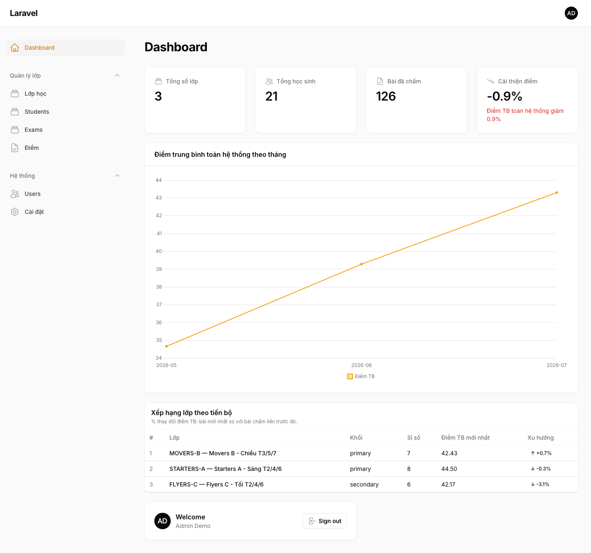
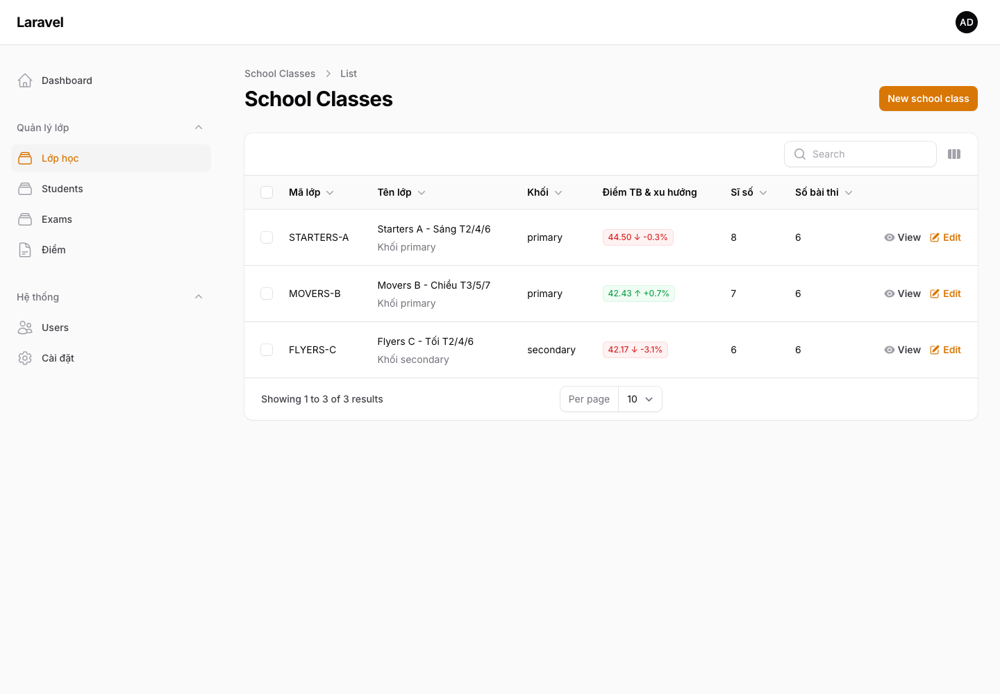
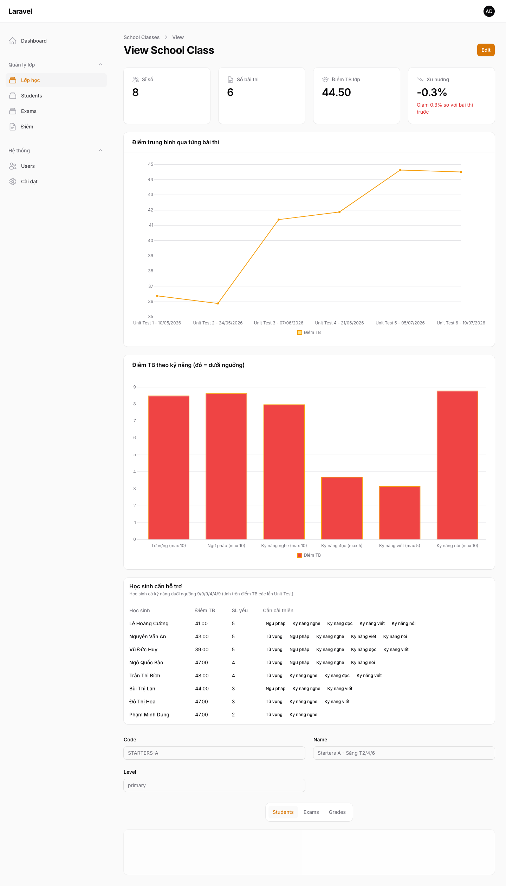
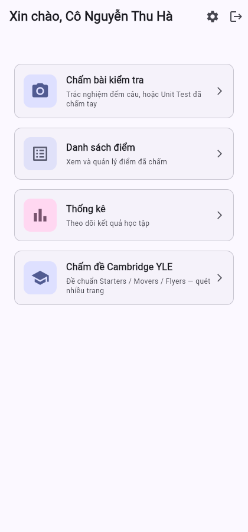
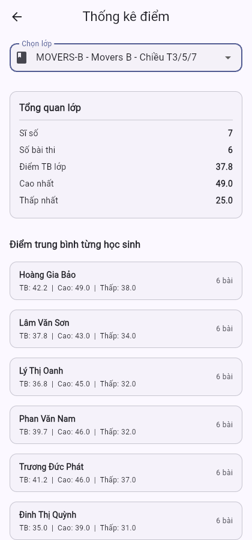
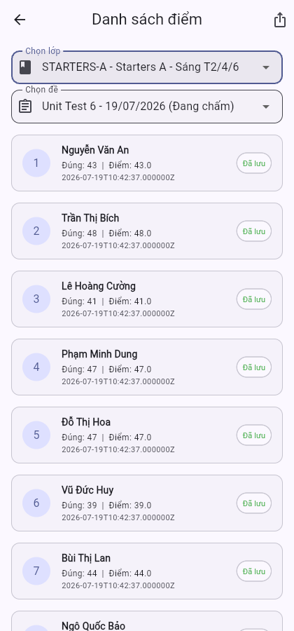

# Hệ thống chấm thi

Nền tảng chấm bài thi cho giáo viên tiếng Anh: chụp ảnh bài làm của học sinh bằng
điện thoại, AI đọc và chấm điểm tự động, giáo viên xác nhận/chỉnh sửa, rồi xem
thống kê tiến bộ theo lớp và xuất báo cáo Excel — không cần nhập điểm thủ công
vào bảng tính.

Gồm 3 phần: **backend Laravel** (API + trang quản trị Filament), **app di động
Flutter** cho giáo viên (chụp bài bằng camera), và một pipeline **AI Vision đa
nhà cung cấp** để OCR/chấm điểm bài thi viết tay.

## Ảnh chụp màn hình

### Dashboard tổng quan hệ thống


### Danh sách lớp — điểm trung bình & xu hướng


### Chi tiết 1 lớp — xu hướng điểm theo bài thi, điểm theo kỹ năng, học sinh cần hỗ trợ


### App di động — trang chủ giáo viên, thống kê lớp, danh sách điểm

| Trang chủ | Thống kê lớp | Danh sách điểm |
|---|---|---|
|  |  |  |

---

## Vì sao dự án này tồn tại

Giáo viên trung tâm tiếng Anh chấm bài giấy xong phải nhập tay từng điểm vào
Excel để theo dõi tiến bộ học sinh — tốn thời gian và dễ sai sót khi lớp đông.
Hệ thống này thay thế bước nhập tay: giáo viên chỉ cần **chụp ảnh bài làm bằng
điện thoại**, hệ thống tự đọc chữ viết tay, so khớp đáp án, tính điểm, và lưu
thẳng vào cơ sở dữ liệu — sẵn sàng cho dashboard và export Excel.

## Hai luồng chấm thi song song

Backend hỗ trợ đồng thời hai mô hình chấm bài, phục vụ hai nhu cầu khác nhau
của trung tâm:

| | **Unit Test** (luồng chính) | **Cambridge YLE** (Starters/Movers/Flyers) |
|---|---|---|
| Dùng cho | Bài kiểm tra định kỳ nội bộ, đếm câu đúng hoặc chấm theo 6 kỹ năng | Đề thi chuẩn Cambridge (Listening / Reading & Writing / Speaking) |
| Cấu trúc đề | Số câu + thang điểm tự do | Part → Question theo đúng format Cambridge, độ khó tăng dần Starters → Movers → Flyers |
| Cách chấm | Đếm số câu đúng, **hoặc** giáo viên chấm tay rồi chụp lại bảng điểm để hệ thống OCR số | AI đọc từng câu trả lời viết tay, so khớp đáp án đúng (tự động), phần viết/nói do giáo viên chấm tay |
| Bảng dữ liệu | `exams`, `grades` | `yle_exams` → `yle_parts` → `yle_questions`, `yle_submissions` → `yle_answers` |
| Trạng thái | Đang dùng thật, có dashboard đầy đủ | Đã xây xong, **mặc định tắt** trên production qua feature flag (đang hoàn thiện) |

## Tính năng nổi bật

**Chấm điểm bằng AI Vision, có fallback đa nhà cung cấp**
Ảnh chụp bài thi được gửi qua chuỗi AI vision theo thứ tự ưu tiên — nếu nhà
cung cấp đầu tiên lỗi hoặc hết quota, hệ thống tự chuyển sang nhà cung cấp kế
tiếp mà không làm gián đoạn giáo viên:

```
Gemini → Groq → Mistral → OpenRouter   (VisionExtractorChain / AnswerSheetExtractorChain)
```

Với đề Cambridge YLE, nếu AI trả lời thiếu câu hỏi bắt buộc, hệ thống **tự
động gọi lại tối đa 3 lần** trước khi đánh dấu bài cần giáo viên xem lại
(`needs_review`) — không bao giờ âm thầm bỏ sót câu.

**Chuẩn hoá đáp án thông minh, không chỉ so khớp chuỗi cứng nhắc**
- Bỏ dấu gạch nối giữa các chữ cái viết tay: `W-A-L-L` → `wall`
- Quy đổi số ↔ chữ: `"fifteen"` ↔ `"15"`
- Nhận diện tick/cross bằng cả ký hiệu (`✓ ✗`) lẫn chữ viết (`yes/no`, `true/false`, `v/x`)
- Bỏ dấu tiếng Việt khi so khớp tên học sinh để chịu được lỗi chính tả của OCR

**Đề thi Cambridge YLE đúng chuẩn**, định nghĩa sẵn theo cấu trúc thật của
Cambridge Assessment English — số phần, loại câu hỏi, thang điểm tăng dần
theo cấp độ:

| Cấp độ | Listening | Reading & Writing | Speaking |
|---|---|---|---|
| Starters | 20 điểm / 4 phần | 25 điểm / 5 phần | 5 điểm |
| Movers | 25 điểm / 5 phần | 35 điểm / 6 phần | 5 điểm |
| Flyers | 25 điểm / 5 phần | 44 điểm / 7 phần (có bài luận tự do) | 5 điểm |

**Dashboard theo lớp, không chỉ theo bài thi đơn lẻ**
- Xu hướng điểm trung bình qua từng kỳ kiểm tra (line chart)
- Điểm trung bình theo 6 kỹ năng: Từ vựng, Ngữ pháp, Nghe, Đọc, Viết, Nói — cột
  đổi màu đỏ/xanh theo ngưỡng đạt/chưa đạt cấu hình được
- Bảng "Học sinh cần hỗ trợ" — tự động liệt kê học sinh có kỹ năng dưới ngưỡng,
  sắp xếp theo số kỹ năng yếu nhiều nhất
- Bảng xếp hạng % tiến bộ giữa các lớp trên dashboard tổng

**Xuất Excel đúng mẫu giáo viên đang dùng thủ công**
Một nút bấm tạo file `.xlsx` với đúng 13 cột giáo viên từng tự tổng hợp bằng
tay (điểm 6 kỹ năng, tổng điểm, cột "kỹ năng cần cải thiện" tự động điền bằng
công thức tương đương `TEXTJOIN`, cột nhận xét để trống cho giáo viên viết tay).

**Phân quyền theo lớp phụ trách**
Giáo viên chỉ xem/sửa được lớp mình dạy; admin thấy toàn hệ thống. Model lớp
học: giáo viên tạo lớp với một mã lớp (`code`) duy nhất, dùng mã đó để tự gắn
tài khoản khác vào lớp khi cần — không có bước "duyệt học sinh xin vào lớp".

**Audit log tự động** cho các thao tác nhạy cảm (đổi điểm, khoá/mở đề, đổi
trạng thái bài chấm) — ghi lại ai đổi gì, khi nào, từ giá trị nào sang giá trị nào.

## App di động (Flutter) — công cụ chấm bài cho giáo viên

App chỉ dành cho giáo viên (không có tài khoản học sinh). Luồng chính:

1. Đăng nhập / đăng ký (có thể nhập mã lớp để join lớp ngay lúc đăng ký)
2. Chọn lớp → chọn kiểu chấm (đếm câu đúng / Unit Test đã chấm tay / Cambridge YLE)
3. Camera tự động chụp khi phát hiện khung hình đứng yên và có chữ — dùng
   Google ML Kit để nhận diện độ ổn định của khung hình (Jaccard similarity
   giữa 2 frame liên tiếp), không cần bấm nút chụp thủ công
4. Backend OCR + chấm điểm, trả kết quả trong vài giây
5. Giáo viên xác nhận/sửa tên học sinh, điểm, rồi lưu
6. Xem lại danh sách điểm, thống kê lớp, xuất Excel ngay trên điện thoại

ML Kit trên máy chỉ đóng vai trò gợi ý (phát hiện lúc nào ảnh đủ nét để chụp) —
việc đọc chữ chính xác và chấm điểm luôn do AI Vision ở backend đảm nhiệm.

## Kiến trúc kỹ thuật

```
backend/   Laravel 11 (PHP 8.2)
├── Filament v3        → trang quản trị (/admin): quản lý lớp, học sinh, đề thi,
│                         điểm, dashboard, cài đặt bật/tắt tính năng
├── Sanctum            → xác thực API cho app di động (token)
├── Spatie Permission  → phân quyền theo role (admin / teacher), 15 permissions
├── Cloudinary         → lưu trữ ảnh bài thi đã chụp
├── PhpSpreadsheet     → xuất báo cáo điểm ra Excel
└── Vision chain        → OCR/chấm điểm qua Gemini/Groq/Mistral/OpenRouter,
                          tự chuyển nhà cung cấp khi một API lỗi

mobile/    Flutter (Dart) — app Android/iOS cho giáo viên
├── camera + google_mlkit_text_recognition → chụp tự động, gợi ý OCR sơ bộ
├── dio + flutter_secure_storage          → gọi API, lưu token an toàn
└── provider                              → quản lý trạng thái đăng nhập
```

## Chạy thử local (SQLite, có sẵn dữ liệu demo)

Không cần cài MySQL hay bất kỳ database server nào — dự án dùng SQLite cho môi
trường local, chỉ cần PHP và Composer.

```bash
cd backend
composer install
cp .env.example .env
php artisan key:generate
touch database/database.sqlite

php artisan migrate:fresh
php artisan db:seed --class="Database\Seeders\DemoSeeder"

php artisan serve
```

Seeder demo (`database/seeders/DemoSeeder.php`) tạo sẵn:
- 1 tài khoản admin + 2 tài khoản giáo viên
- 3 lớp học (Starters/Movers/Flyers) với 6–8 học sinh mỗi lớp
- 6 kỳ kiểm tra/lớp trải dài nhiều tháng, điểm có xu hướng tăng dần theo thời
  gian và vài học sinh cố tình yếu ở 1–2 kỹ năng — để dashboard, biểu đồ xu
  hướng và bảng "học sinh cần hỗ trợ" có dữ liệu thật để xem
- 1 đề Cambridge YLE (Starters Listening) kèm vài bài nộp mẫu

Đăng nhập trang quản trị tại `http://127.0.0.1:8000/admin`:

| Vai trò | Email | Mật khẩu |
|---|---|---|
| Admin | `admin@demo.local` | `Password123!` |
| Giáo viên | `teacher1@demo.local` | `Password123!` |

> Lưu ý: `DemoSeeder` chỉ dùng để trình diễn trên máy local, không được gọi
> trong luồng seed production (`DatabaseSeeder`).

## Trạng thái dự án

Đang vận hành thật cho luồng Unit Test (chấm đếm câu đúng / chấm tay 2 ảnh).
Luồng Cambridge YLE đã hoàn chỉnh về kỹ thuật (đề mẫu, auto-grading, dashboard
kết quả) nhưng đang tắt mặc định trên production trong lúc hoàn thiện trải
nghiệm giáo viên.
